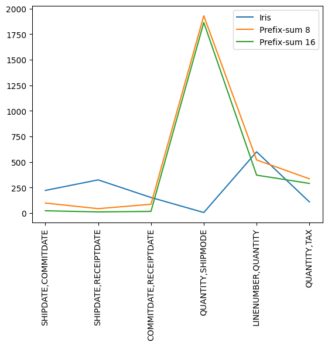

# Report

## Problem specification

For two columns $\mathcal{C}_1, \mathcal{C}_2$ in a dataset, given $(l_1, u_1), (l_2, u_2)$, try to estimate:

$$
\mathrm{Card}(\{(x, y) \in \mathcal{C}_1 \times \mathcal{C}_2 \,|\, l_1 \leqslant x \leqslant u_1 \land l_2 \leqslant y \leqslant u_2\})
$$ 

## Experiment

### Dataset

We use the sample dataset used by the [Iris demo](https://github.com/tjluyao/iris_demo). It indicates that there are 6 column sets are modeled using the pretrained Iris model. We will test on the column sets above.

### Benchmarks

We use the same benchmark as the [Iris paper](http://yao.lu/iris.pdf), which is `GMQ` and the `95th percentile`. 

The `GMQ` is defined as below:

$$
\mathrm{GMQ} = \exp\left[\frac{1}{N}\sum_{i = 0}^{N - 1}\log{q_i}\right]
$$

Where $q_i$ is the `q-error` of the $i$-th query:

$$
q_i = \max\left(\frac{\mathrm{Est}_i}{\mathrm{GT}_i}, \frac{\mathrm{GT}_i}{\mathrm{Est}_i}\right)
$$

Note that $\mathrm{Est}_i$ is the estimate value of the $i$-th query and $\mathrm{GT}_i$ is the ground-truth respectively.

## Results

We compare our prefix-sum solution with `Iris`.

### Space overhead

| Method        | Overhead |
| ------------- | -------- |
| Iris          | 50KB     |
| Prefix-sum 8  | 512B     |
| Prefix-sum 16 | 2KB      |

### GMQ

| Iris | Prefix-sum 8 | Prefix-sum 16 |
| :--: | :----------: | :-----------: |
| 1.97 |     2.12     |     1.43      |
| 2.04 |     1.79     |     1.34      |
| 1.94 |     1.96     |     1.39      |
| 1.73 |     4.31     |     5.01      |
| 2.99 |     3.13     |     2.35      |
| 1.99 |     2.52     |     2.15      |

### 95th percentile

|  Iris  | Prefix-sum 8 | Prefix-sum 16 |
| :----: | :----------: | :-----------: |
| 221.29 |    97.88     |     22.35     |
| 324.34 |    42.87     |     11.31     |
| 152.37 |    85.88     |     16.30     |
|  5.34  |   1928.78    |    1863.43    |
| 598.87 |    519.16    |    370.70     |
| 108.68 |    334.65    |    289.54     |

## Discussion

TODO.